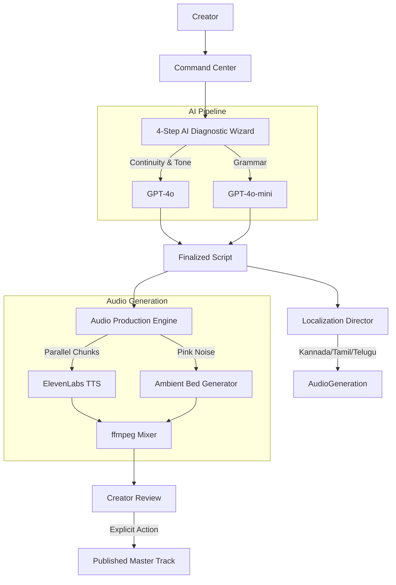

# PocketVerse
    

PocketVerse is an AI production studio for serialized fiction and audio drama creators that replaces a five-person creative team with a single, highly-orchestrated platform. It automatically cross-checks continuity between episodes, copyedits dialogue, directs genre-specific tone remixes, and renders cinematic multi-language audio dramas in seconds.

*[Insert link to 2-minute demo video here]*

---

## The Problem
Producing high-quality serialized audio fiction is cost-prohibitive and technically demanding for independent creators. Hiring voice actors and sound engineers for multi-episode runs breaks most budgets, while maintaining strict narrative continuity (character voices, timeline consistency, plot beats) across dozens of self-written episodes becomes a massive logistical burden that often leads to plot holes and abandoned series. 

## The Solution
PocketVerse collapses an entire audio production studio into a five-role AI pipeline:
- **Continuity Editor**: Cross-checks new episodes against previous ones for plot holes.
- **Copyeditor**: Cleans up grammar and dialogue cadence.
- **Genre Director**: Remixes the episode into distinct atmospheres while keeping the plot intact.
- **Voice Director**: Synthesizes and mixes the master audio track with soundscapes.
- **Localization Director**: Translates and produces native-sounding audio in regional languages.

## Key Features

### 1. Continuity Editor (GPT-4o)
- **Context-Aware Review**: Compares the current script against the preceding episode to identify timeline errors and character voice breaks.
- **Cliffhanger Scoring**: Evaluates the narrative hook at the end of the episode on a 1-10 scale and offers an automated rewrite if the tension falls flat.
- **Explicit Approval**: AI suggestions are presented to the creator with a suggested fix. Changes are only applied if explicitly accepted.

### 2. Copyeditor (GPT-4o-mini)
- **Dialogue & Pacing**: Scans the manuscript specifically for dialogue cadence and grammatical consistency, allowing creators to accept or reject edits line-by-line.

### 3. Genre Director (GPT-4o)
- **Atmosphere Remixing**: Improvise a script into Noir, Horror, Funny, Drama, or Sci-Fi. The director preserves core plot beats and character identities while altering the descriptive vocabulary and pacing.

### 4. Voice Director (ElevenLabs & ffmpeg)
- **Parallel Chunked Rendering**: The pipeline splits the finalized script and executes TTS generation concurrently. It renders an 8-minute episode in approximately 10 seconds.
- **Custom Soundscape Mixing**: Uses a Paul Kellet Pink Noise algorithm to generate a natural wind ambient soundscape bed. 
- **Automated Mixing**: `ffmpeg` ducks the soundscape behind the narration and strictly caps the ambient bed to the exact duration of the generated speech. 
- **Live Telemetry HUD**: Creators watch a dual-ring visualizer and real-time backend stream logs during generation.
- **Deliberate Publishing**: Generating audio is decoupled from publishing. Creators must explicitly trigger a separate publish action.

### 5. Localization Director
- **Code-Mixed Translation**: Translates finalized episodes into Kannada, Tamil, and Telugu using natural, spoken regional phrasing rather than stiff textbook translation.
- **Native Audio Production**: Renders narrated audio using ElevenLabs' native multi-language voices. Each localized version operates on its own independent generation and publishing lifecycle.

## System Architecture



## Tech Stack

| Component | Technology | Why it was chosen |
| :--- | :--- | :--- |
| **Frontend** | React 18 + Vite | Fast HMR during development and stable SPA routing. |
| **Styling** | Vanilla CSS | Strict adherence to the tech-noir design system without framework overhead. |
| **Backend** | Express + TypeScript | Lightweight, strictly-typed request handling for the AI orchestrator. |
| **Database** | SQLite | Zero-config persistent local storage ideal for a hackathon environment. |
| **Writing Pipeline** | OpenAI GPT-4o | Superior instruction-following for complex continuity and tone-remix tasks. |
| **Copyediting** | OpenAI GPT-4o-mini | Low latency and cost-effective for straightforward grammar passes. |
| **Audio Synthesis** | ElevenLabs TTS | State-of-the-art prosody and multi-language support. |
| **Audio Mixing** | ffmpeg | Reliable, scriptable command-line audio ducking and concatenation. |

## Quickstart

Run the entire stack (Express backend and Vite frontend) with a single command. The script handles dependency installation and concurrent process management automatically.

```bash
# Clone the repository and run the start script
./start.sh
```

- **Frontend Application**: `http://localhost:3000`
- **Backend API Server**: `http://localhost:5000`

## Known Limitations & What's Next
- **Continuity Memory Bound**: The Continuity Editor currently only checks the manuscript against the *immediately previous* episode (Episode N-1). It does not maintain a global context window of the entire series. Moving to an RAG (Retrieval-Augmented Generation) system to check global series bibles is the next planned improvement.
- **Single Ambient Bed**: The audio engine currently relies exclusively on a generated wind soundscape. Future updates will introduce dynamic Foley insertion based on script content.

## Team
Built for the [Insert Hackathon Name] hackathon. Focusing on AI-powered creator workflows and breaking down barriers to audio production.
